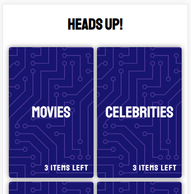
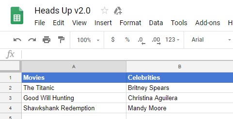

# Heads Up v2.0

Check it out on mobile and add to homescreen: https://qvo44xr4p9.codesandbox.io/

This React mobile web app is inspired by the native iOS and Android game,[_"Heads Up!"_][1]

## Introduction

I find the mobile game _"Heads Up!"_ to be really fun to play in group settings. There's just a couple of things about the original that I don't care for:

- Ability to get repeat cards from a deck per playing session
- \$1.00 for paid decks
- The "Build-your-own-deck" mode isn't easy to set up on mobile

#### Solutions:

- No more repeats per playing session
- 100% free
- Building your own deck is as simple as adding words to a google sheet

## Set up Your Own Game

Fork https://codesandbox.io/s/qvo44xr4p9. Open the link to the project (in the psuedo-browser's address bar) and add to home screen! Then:

1. Create a google sheet
2. Each column is a deck, add the name of the deck to the top row
3. [Request an API key][2]
4. Replace your new API key with `API_KEY` and the sheet ID with `SHEET_ID` in `componentDidMount` of `index.js` in your codesandbox.

## How to Play

Almost exactly like the original:

- Choose a deck
- Put phone on forehead and wait for game to start
- Tilt phone down for correct, up for skip
- **Shake the phone back-and-forth to exit the game or pre-game countdown at any time**

## Screenshots

 

## Community Decks

Be sure to submit any decks you've made and I'll add them to the example deck below.

Example deck: https://docs.google.com/spreadsheets/d/1zwtuoozCw-8iGHFhJiolPz0Loy4sk17mHffVorw2z1s

[1]: https://www.warnerbros.com/videogame/heads
[2]: https://developers.google.com/sheets/api/guides/authorizing#APIKey
[3]: https://docs.google.com/spreadsheets/d/1zwtuoozCw-8iGHFhJiolPz0Loy4sk17mHffVorw2z1s

### To Do

- Add sound bites for countdown and for correct/skip actions.
